# SQL PROEJCT: SQLite Relational Database to Excel and Power Point

## Chinook Music Store: Querying Chinook Database to extract Data


# Table of Content
- [Project Title](#Project-Title)
- [My Role](#My-Role)
- [Project Overview](#Project-overview)
- [Problem Statement](#Problem-statement)
- [Stakeholder Engagement](#Stakeholder-Engagement)
  - [Target Stakeholder](#Target-stakeholder)
  - [Use Cases](#Use-cases)
  - [Stakeholders Stories](#Stakeholder-stories)
  - [Acceptance Criteria](#Acceptance-criteria)
  - [Success Criteria](#Success-criteria)
- [Data Source & Tools](#Data-source-&-Tools)
  - [Data Structure](#Data-Structure)
- [Methodology](#Methodology)
  - [Development](#Development)
    - [Setting Up My Local Environment](#Setting_Up_My_Local_Environment)
    - [Database Model_Diagram](#Database_Model_Diagram)
    - [Exploratory Data Analysis (EDA)](#Exploratory_Data_Analysis_(EDA))
    - [Extracted Queries Analysis](#Extracted_Queries_Analysis)
    - [Export Data from DB Browser into Spreadsheet](#Export_Data_from_DB_Browser_into_Spreadsheet)
- [Detailed Insights and Recommendations](#Detailed-Insights-and-Recommendations)
  - [PROBLEM STATEMENT 1_INSIGHTS](#PROBELM_STATEMENT_1:_Identify_and_Understand_High-Value_Customers)
  - [PROBLEM STATEMENT 2_INSIGHTS](#PROBLEM_STATEMENT_2:_Understand_Music,_Artist_Preference_and_Behaviour)
  - [PROBLEM_STATEMENT_3_INSIGHTS](#PROBLEM_STATEMENT_3:_Optimise_Product_offering_base_on_MediaType_and_Album_Popularity)

# Project Title 
SQL Analysis of Chinook Music Store: Customer Behavior, Sales Performance & Revenue Insights

# My Role
**Business Intelligence Analyst**  

- Responsibility
	- Wrote and optimised complex SQL quries
 	- Explored and model relational data from the chinook database
  	- Translated business questions into strategic recommendations
  	- Visualised result in PowerPoint for storytelling

# Project Overview
In this project i will be quering the Chinook Database which is a SQLlite Database that holds information or data about a music store. For this project, i will be leveraging data-driven tactics to assist the Chinook team to handle complexity  and business challenges or hidden potential business opportunity. In order to achieve this, Chinook Music Store have recently consulted me as a Business Intellligence Analyst to help make sense of their data to see how I can use my skills to reveal important insights buried within.  

As a Business Intelligence Analyst in this project my role is to perform thorough analysis to assist the chinook team with understanding the media in their store, their customers, employees, and their invoice information. This has been achieved through the use of my Analytical skills, hoping to derive comprehensive insights that will guide both the operational and overall improvement, helping Chinook Store to continue to maintain customer retention through adequate and appropriate customer service satisfaction.

# Problem Statement 
The Chinook Music Store lacked visibility into customer purchasing behaviour, genre and media format preferences, and artist profitability across regions. Addiontionally, there was no structured, analyst-friendly SQL environment to support efficient querying, data extraction, and export for deeper analysis and data visualisation.

Key business problem includes:
- Difficulty identifying top-performing customers and their geographic distribution
- Limited insight into popular genres, media types, and artist revenue performance
- Lack of a centralised and user-friendly SQL workspace for analyst
- No defined process for exporting query outputs and transforming them into business insights
- Inefficient communication of findings to stakeholders in visual and actionable format

This prohject addressess these challenges by:
- Establishing a local SQLite environment using **DB Browser for SQLite**  to execute and export SQL queries
- Writing tailored SQL scripts to answer key business questions
- Exporting cleaned query results to CSV format for structured analysis
- Building a Power Point presentation to communicate insights clearly and persuasively to stakeholders

# Stakeholder Engagement

## Target Stakeholder
- Business Executives (Store Management, Sales Directors)
- Marketing and Campaign Teams
- Event Manager
- Data Analyst and Reporting Teams

## Use Cases
- Identify high-value customers and their geographic distribution for targeted promotions
- Anlyse most popular music genres and media types by country to guide stock and campaignes
- Determine top-earning atrists, genres, and albums to inform performance contracts and event planning
- Set up e resusable SQL environment for analyst to run ad-hoc queries and exract business intelligence
- Present inisghts in stakeholder-friendly formats (charts, KPIs, summaries) through PowerPoint slides.

## Stakeholder Stories
- "As a Store Manager, I need to iidentify our most loyal and high-spending customers to increase retention."
- "As the Marketing Manager, I want to track genre popularity by region to better localise campaings."
- "As the Event/Concert Manager, I need insights on which artists brings in the most revenue so we can plan concert bookings."
- "As a Data Analyst, I want a consistent local SQL environment to run qureis and export for rewgular reporting."

## Acceptance Citeria
- A local SQL envirnemnt is properly configured (e.g., DB Browser for SQLite) for ease of use and export
- Query results are accurately exported to CSV files with proper formatting and labelling
- Key insights includes customer, genre, media type, and artist performance metrics
- PowerPoint visuals include charts, KPIs, maps (If applicable), and data-driven recommendations
- Business Questions are clealy answered and aligned with stakeholder goals

## Success Citeria
- Executive are equiped with actionable insights to drive strategic decisions
- Marketing teams run more affective, data-backed campaigns tailored by region and genre
- Artist relations benefit from insights that optimise booking decisions and partnership strategies
- Analyst gain resuable and efficient SQL analysis workflow for ongoing reporting
- Insights are clearly comunicated through profesional presentations, improving data adoption across the organisation.

# Data Source & Tools
- **Database:** Chinook (SQLite format)
- **Main Tables:** Customers, Invoices, InvoiceLines, Tracks, Albums, Artists, Employees, Genres, Media Types, and Track.

- **Tools Used:**
  	- SQLite + DB Browser
  	- Excel (for result export and pivot analysis)
  	- PowerPoint (for visualisation and storytelling

## Data Structure
To assist to execute the queries ahead, the schema for the Chinook Database is provide below.  
  
**Artist Table**

| Column Name | Data Type | Description |
| --- | --- | --- |
| Artisid | Integer | Unique Identifier of each artist |
| Name | Nvarcher(120) | Name of the Artist |
 
**Album Table**

| Column Name | Data Type | Description |
| --- | --- | --- |
| AlbumId | Integer | Unique identifier for each Album |
| Title | Nvarcher(160) | Title of the Album |
| ArtistId | Integer | Foriegn key referencing the Artist table (ArtistId) |

Relationship:  
ArtistId in the Album table is for key linked to ArtistId (Primary Key) in the Artist table.

**Track Table**

| Column Name | Data Type | Description |
| --- | --- | --- |
| TrackId | Integer | Unique identifier for each Track |
| Name | Nvarcher(200) | Name of the track |
| AlbumId | Integer | Foreign Key referencing the Album table (AlbumId) |
| MediaTypeId | Integer | Foreign Key referencing the Album table (MediaTypeId) |
| GenreId | Integer | Foreign Key referencing the Album table (GenreId) |
| Composer | Nvarcher(220) | Name of the composer |
| Milliseconds | Integer | Durations of the track in milliseconds |
| Bytes | Integer | Size of the track in bytes |
| Unit Price | Numeric(10,2) | Price of the track |

Relationships:  
- AlbumId in the Track table is a foreign key linked to the AlbumId (primary key) in the Album table.
- MediaTypeId in the Track table is a foreign key linked to the MediaTypeId (primary key) in the MediaType table.
- GenreId in the Track table is a foreign key linked to the GenreId (primary key) in the Genre table.

**MediaType Table**

| Column Name | Data Type | Description |
| --- | --- | --- |
| Media Type | Integer | Unique identifier for each media type |
| Name | Nvarchar(120) | Name of the media type |

**PlayList Table**

| Column Name | Data Type | Description |
| --- | --- | --- |
| PlaylistId | Integer | Unique identifier for each playlist |
| Name | Nvarchar(120) | Name of Playlist |

**Playlist Track Table**

| Column Name | Data Type | Description |
| --- | --- | --- |
| PlaylistTrackId | Integer | Foreign key referencing the playlist table (PlaylistId) |
| Track | Integer | Name of the playlist track |

Relationship:  
- PlaylistId in the PlaylistTrack table is a foreign key linked to the PlaylistId (primary key) in the Playlist table.
- TrackId in the PlaylistTrack table is a foreign key linked to the TrackId (primary key) in the Track table.

**Genre Table**

| Column Name | Data Type | Description |
| --- | --- | --- |
| GenreId | Integer | Unique identifier for each genre |
| Name | Nvarchar(120) | Name of the genre |

**Empployee Table**

| Column Name | Data Type | Description |
| --- | --- | --- |
| EmployeeId | Integer | Unique identifier  for each employee |
| LastName | Nvarchar(20) | Last name of the employee |
| FirstName | Nvarchar(20) | First name of the employee |
| Title | Narchar(30) | Title of The employee |
| ReportTo | Integer | EmployeeId of the employee’s supervisor |
| BirtDate | DATETIME | Birth date of the employee |
| HireDate | DATETIME | Hire date of the employee |
| Address | Nvarchar(70) | Address of the employee |
| City | Nvarchar(40) | City of the employee |
| State | Nvarchar(40) | State of the employee |
| Country | Nvarchar(40) | Country of the employee |
| PostalCode | Nvarchar(10) | Postal Code of the employee |
| Phone | Nvarchar(24) | Phone of the employee |
| Fax | Nvarchar(24) | Fax number of the employee |
| Email | Nvarchar(60) | Email address of the employee |

**Customer Table**

| Column Name | Data Type | Description |
| --- | --- | --- |
| CustomerId | Integer | Unique identifier for each customer |
| FirstName | Nvarchar(40) | First name of the customer |
| LastName | Nvarchar(20) | Last name of the customer |
| Company | Nvarchar(80) | Company name of the customer |
| Address | Nvarchar(70) | Address of the customer |
| City | Nvarchar(40) | City of the customer |
| State | Nvarchar(40) | State of the customer |
| Country | Nvarchar(40) | Country of the customer |
| PostalCode | Nvarchar(10) | Postal code of the customer |
| Phone | Nvarchar(24) | Phone number of the customer |
| Fax | Nvarcher(24) | Fax number of the customer |
| Email | Nvarchar(60) | Email address of the customer |
| SupportRepId | Integer | EmployeeId of the customer’s support representative. |

**InvoiceLine Table**

| Column Name | Data Type | Description |
| --- | --- | --- |
| InvoiceLineId | Integer | Unique identifier for each invoice line |
| InvoiceId | Integer | Foreign key referencing the invoice table (InvoiceId) |
| TrackId | Integer | Foreign key referencing the Track table (TrackId) |
| UnitPrice | Numeric(10,2) | Price per unit of the track |
| Quantity | Integer | Quantity of tracks purchased in the invoice line |

Relationship:  
- InvoiceId in the InvoiceLine table is a foreign key linked to the InvoiceId (primary key) in the Invoice table.
- TrackId in the InvoiceLine table is a foreign key linked to the TrackId (primary key) in the Track table.

**Invoice Table**

| Column Name | Data Type | Description |
| --- | --- | --- |
| InvoiceId | Integer | Unique identifier for each invoice |
| CustomerId | Integer | Foreign key referencing the customer (CustomerId) |
| InvoiceDate | DATETIME | Date of the invoice |
| BillingAddress | Nvarchar(70) | Billing address of the invoice |
| BillingCity | Nvarchar(40) | Billing city of the invoice |
| BillingState | Nvarchar(40) | Billing state of the invoice |
| BillingCountry | Nvarchar(40) | Billing country of the invoice |
| BillingPostalcode | Nvarchar(100) | Billing postal code of the invoice |
| Total | Numeric(10,2) | Total amount of the invoice |


# Methodology
## Development
- Set up the local environment
- Database diagram
- Exploratory data Analysis
- Extracted Queries Analysis
- Exported Data Result

### Setting Up My Local Environment
The  enviroment that is being use in this project is pretty quick to set up by following the setup below 
- Downloaded the DB Broweser for SQLite
- Connected the Broswer to the Database provided by Chinook Music Store
- Click on Open Database
- Navigate to the Chinook.db file (probably in download or folder that the Chinook.db is saved)
- Click on Execute SQL
- Start querying my data


### Database Model Diagram
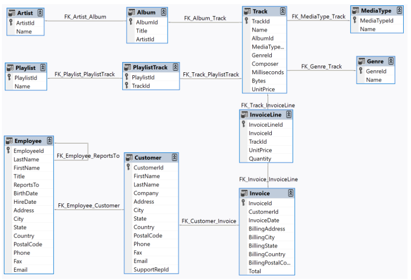

### Exploratory Data Analysis (EDA)

Given the comprehensive set of SQL queries of tackling a wide range of analytical questions. However, before executing these queries, it's essential to perform  Exploratory Data Analysis (EDA) to ensure;
1. So i could understand the structure and content of my data
2. My queries return valid, meaningful results.
3. I would be able to identify data issues (e.g., missing values, unexpected duplicates or outliers).

Here are some **EDA checklist** queries that i performed before executing my analysis queries, grouped into logical stages:

##### Schema Undrstanding
```sql
-- List of all tables
SELECT name FROM sqlite_master WHERE type='table';

-- Columns in a specific tables
PRAGMA table_info('Invoice');
PRAGMA table_info('MediaType');
PRAGMA table_info('Customer');
PRAGMA table_info('Artist');
PRAGMA table_info('Album');

```
##### Table Row Count and Column Summary
```Sql
-- Table Row count and Column Summary
-- this check the volume of records and expected data density in each table

SELECT 'Customer' AS Table_Name, COUNT(*) AS Row_Count FROM Customer
UNION ALL
SELECT 'Invoice', COUNT(*) FROM Invoice
UNION ALL
SELECT 'InvoiceLine', COUNT(*) FROM InvoiceLine
UNION ALL
SELECT 'Track', COUNT(*) FROM Track
UNION ALL
SELECT 'Genre', COUNT(*) FROM Genre;
```

##### Data Quality Checks 3
```sql
-- to checks for NULLs in critical fields (As i wouldn't want to join or grou by nulls.)
SELECT 
  SUM(CASE WHEN FirstName IS NULL THEN 1 ELSE 0 END) AS Null_FirstNames,
  SUM(CASE WHEN LastName IS NULL THEN 1 ELSE 0 END) AS Null_LastNames
FROM Customer;

-- check for duplicates emails
SELECT Email, COUNT(*) AS Count
FROM Customer
GROUP BY Email
HAVING COUNT(*) > 1;

```

##### Basic Distribution and Aggregation Patterns 4
```sql
-- Number of unique values
SELECT COUNT(DISTINCT BillingCountry) FROM Invoice;
SELECT COUNT(DISTINCT GenreId) FROM Track;

-- Frequency of countries in invoices
SELECT BillingCountry, COUNT(*) 
FROM Invoice
GROUP BY BillingCountry
ORDER BY COUNT(*) DESC;

-- Frequency of genres
SELECT GenreId, COUNT(*) 
FROM Track
GROUP BY GenreId
ORDER BY COUNT(*) DESC;

```


##### Value Range Checks & Outliers 5
```sql
-- Invoice value range
SELECT MIN(Total), MAX(Total), AVG(Total) FROM Invoice;

-- Track length in milliseconds
SELECT MIN(Milliseconds), MAX(Milliseconds), AVG(Milliseconds) FROM Track;

```

##### Join Validity 6
```sql
-- Are there any orphan rows in relationships?
SELECT COUNT(*) 
FROM Invoice
LEFT JOIN Customer ON Invoice.CustomerId = Customer.CustomerId
WHERE Customer.CustomerId IS NULL;

```

##### Temporal Coverage 7
```sql
-- check invoice date ranges
SELECT 
    MIN(InvoiceDate) AS StartDate, 
    MAX(InvoiceDate) AS EndDate
FROM Invoice;
```


**Benefit of this EDA before extracted queries analysis**
- The “Top Customer/Top Genre” queries depend on valid joins—EDA confirms those joins won’t fail due to NULLs.

- The media type and country breakdowns rely on complete, non-null sales and invoice data.

- The ranking queries use SUM() and COUNT()—ensuring no outliers or NULLs beforehand improves accuracy.

- The grouping logic assumes categories like Genre, MediaType, and Country are clean and complete—EDA confirms that.


### Extracted Queries Analysis
#### Problem Statement 1: Identify and Understand High-Value Customers
**Tailored Questions:**  
```sql
/*
1. Which countries have the most invoices?
*/

SELECT BillingCountry,
		COUNT(*) AS Invoice_Per_Country
FROM Invoice
GROUP BY BillingCountry
ORDER BY 2 DESC;
```
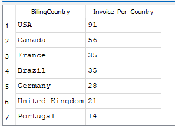


```sql
/*
1. Which city has the best customers?
-- As we want to throw a promotional Music Festival in the city we made the most money.
*/
SELECT BillingCity,
		SUM(Total) AS Total_Sales
FROM Invoice
GROUP BY BillingCity
ORDER BY Total_Sales DESC
LIMIT 1;
```
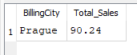


```sql
-- Who is the best customer?
-- The customer who spent the most moneyin the history of the nusic store.
1
SELECT  Customer.CustomerId,
		Customer.FirstName,
		Customer.LastName,
		SUM(InvoiceLine.Quantity * InvoiceLine.UnitPrice) AS Total
FROM InvoiceLine
JOIN Invoice
ON InvoiceLine.InvoiceId = Invoice.InvoiceId
JOIN Customer
ON Invoice.CustomerId = Customer.CustomerId
GROUP BY Customer.FirstName
ORDER BY 4 DESC;
```
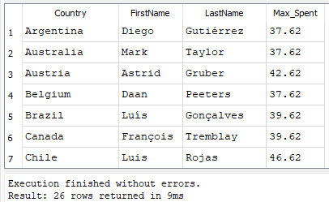


```sql
/*
-- Customer who spent the most in each country, and their spending amount.
-- Making sure query retuen the country along with the top customers and how much money they spent.
*/

SELECT  
    Tbl.BillingCountry AS Country,
    Tbl.FirstName,
    Tbl.LastName,
    Tbl.Amount_Spent AS Max_Spent
FROM (
    SELECT  
        Customer.CustomerId,
        Customer.FirstName,
        Customer.LastName,
        Invoice.BillingCountry,
        SUM(Invoice.Total) AS Amount_Spent
    FROM Customer
    JOIN Invoice
        ON Invoice.CustomerId = Customer.CustomerId
    GROUP BY Customer.CustomerId, Customer.FirstName, Customer.LastName, Invoice.BillingCountry
) Tbl
WHERE Tbl.Amount_Spent = (
    SELECT MAX(SubTbl.Amount_Spent)
    FROM (
        SELECT  
            Customer.CustomerId,
            Customer.FirstName,
            Customer.LastName,
            Invoice.BillingCountry,
            SUM(Invoice.Total) AS Amount_Spent
        FROM Customer
        JOIN Invoice
            ON Invoice.CustomerId = Customer.CustomerId
        GROUP BY Customer.CustomerId, Customer.FirstName, Customer.LastName, Invoice.BillingCountry
    ) SubTbl
    WHERE SubTbl.BillingCountry = Tbl.BillingCountry
)
ORDER BY Tbl.BillingCountry, Tbl.Amount_Spent DESC;

```
 


#### Problem Statement 2: Understand Music Preferences and Customer Behavior
**Tailored Questions:**

```sql
/*
-- frist, I find which artist has the mostaccording to the InvoiceLines.
-- then find Which customer spent the most on the top-earning artist?
*/

SELECT * FROM Invoice;

SELECT  Artist.ArtistId,
		Artist.Name,
		COUNT(*) AS Total
 FROM Artist
    JOIN Album
        ON Artist.ArtistId = Album.ArtistId
    JOIN Track
        ON Track.AlbumId = Album.AlbumId
    JOIN InvoiceLine
        ON InvoiceLine.TrackId = Track.TrackId
    JOIN Invoice
        ON Invoice.InvoiceId = InvoiceLine.InvoiceId
    JOIN Customer
        ON Customer.CustomerId = Invoice.CustomerId
GROUP BY 1
ORDER BY 3 DESC;

SELECT 
    Tbl.Artist_name,
    Tbl.CustomerId,
    Tbl.FirstName,
	Tbl.LastName,
    Tbl.Total
FROM (
    SELECT  
        Artist.ArtistId AS Artist_Id,
        Artist.Name AS Artist_name,
        Customer.CustomerId AS CustomerId,
		Customer.FirstName AS FirstName,
        Customer.LastName AS LastName,
        SUM(InvoiceLine.Quantity * InvoiceLine.UnitPrice) AS Total
    FROM Artist
    JOIN Album
        ON Artist.ArtistId = Album.ArtistId
    JOIN Track
        ON Track.AlbumId = Album.AlbumId
    JOIN InvoiceLine
        ON InvoiceLine.TrackId = Track.TrackId
    JOIN Invoice
        ON Invoice.InvoiceId = InvoiceLine.InvoiceId
    JOIN Customer
        ON Customer.CustomerId = Invoice.CustomerId
    WHERE Artist.Name = 'Iron Maiden'
    GROUP BY Artist.ArtistId, Artist.Name, Customer.CustomerId, Customer.LastName
) Tbl
ORDER BY Tbl.Total DESC;
```
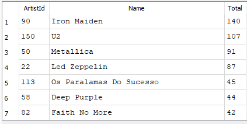    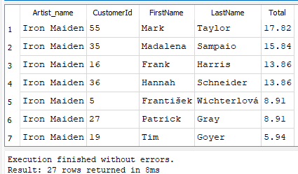 


```sql
/*
-- Return Rock Music Listener for each country.
*/ 

SELECT DISTINCT
    Customer.FirstName,
    Customer.LastName,
    Customer.Email,
    Customer.Country,
    Genre.Name
FROM Customer
JOIN Invoice
ON Customer.CustomerId = Invoice.CustomerId
JOIN InvoiceLine
ON InvoiceLine.InvoiceId = Invoice.InvoiceId
JOIN Track
ON Track.TrackId = InvoiceLine.TrackId
JOIN Genre
ON Genre.GenreId = Track.GenreId
WHERE Genre.GenreId = '1'
ORDER BY Customer.Email;
```


```sql
/*
  -- Who is writing the rock music?
  -- (Optional) Write a query that returns the Artist name and total track count of the top 10 rock bands.
*/

SELECT  Artist.ArtistId,
		Artist.Name,
		COUNT(*) AS Genre_Count
FROM Track
JOIN Genre 
ON Genre.GenreId = Track.GenreId
JOIN Album
ON Album.AlbumId = Track.AlbumId
JOIN Artist
ON Artist.ArtistId = Album.ArtistId
WHERE Genre.GenreId = 1
GROUP BY Artist.ArtistId
ORDER BY 3 DESC
LIMIT 10;
```
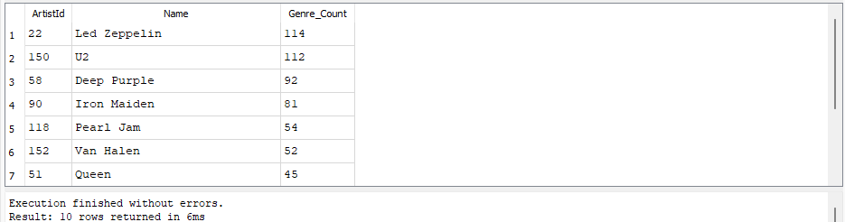 

```sql
/*
-- Most popular music genre by country.
*/
SELECT 
    Tbl.Country,
    Tbl.GenreName,
    Tbl.Max_Sales
FROM (
    SELECT  
        Customer.Country AS Country,
        Genre.Name AS GenreName,
        COUNT(InvoiceLine.InvoiceLineId) AS Max_Sales
    FROM Genre
    JOIN Track
        ON Track.GenreId = Genre.GenreId
    JOIN InvoiceLine
        ON InvoiceLine.TrackId = Track.TrackId
    JOIN Invoice
        ON Invoice.InvoiceId = InvoiceLine.InvoiceId
    JOIN Customer
        ON Customer.CustomerId = Invoice.CustomerId
    GROUP BY Customer.Country, Genre.Name
) Tbl
WHERE Tbl.Max_Sales = (
    SELECT MAX(SubTbl.Max_Sales)
    FROM (
        SELECT  
            Customer.Country AS Country,
            Genre.Name AS GenreName,
            COUNT(InvoiceLine.InvoiceLineId) AS Max_Sales
        FROM Genre
        JOIN Track
            ON Track.GenreId = Genre.GenreId
        JOIN InvoiceLine
            ON InvoiceLine.TrackId = Track.TrackId
        JOIN Invoice
            ON Invoice.InvoiceId = InvoiceLine.InvoiceId
        JOIN Customer
            ON Customer.CustomerId = Invoice.CustomerId
        GROUP BY Customer.Country, Genre.Name
    ) SubTbl
    WHERE SubTbl.Country = Tbl.Country
)
ORDER BY Tbl.Country, Tbl.GenreName;
```
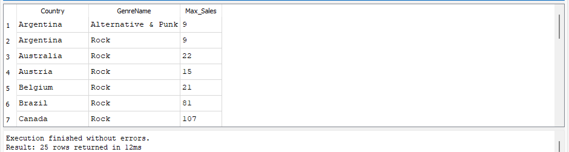 


#### Problem Statement 3: Optimize Product Offering Based on Media Type and Album Popularity
**Tailored Question:**

```sql
/*
11. Which is the most popular media type?
*/

SELECT  MediaType.MediaTypeId,
		MediaType.Name,
		COUNT(*) AS MediaType_cOUNT
FROM Track
JOIN MediaType
ON MediaType.MediaTypeId = Track.MediaTypeId
GROUP BY MediaType.MediaTypeId
ORDER BY 3 DESC;

```
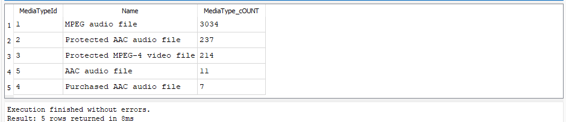 


```sql
/*
-- Top 10 Country Total_Spent by MediaType and Spending Categories.
*/

SELECT  
    MediaType.MediaTypeId,
    MediaType.Name,
    Invoice.BillingCountry,
    SUM(Invoice.Total) AS Total_Spent,
    CASE 
        WHEN SUM(Invoice.Total) > 1000 THEN 'High Spender'
        WHEN SUM(Invoice.Total) BETWEEN 400 AND 1000 THEN 'Medium Spender'
        ELSE 'Low Spender'
    END AS Spending_Category
FROM MediaType
JOIN Track
    ON MediaType.MediaTypeId = Track.MediaTypeId
JOIN InvoiceLine
    ON InvoiceLine.TrackId = Track.TrackId
JOIN Invoice
    ON Invoice.InvoiceId = InvoiceLine.InvoiceId
JOIN Customer
    ON Customer.CustomerId = Invoice.CustomerId
GROUP BY MediaType.MediaTypeId, MediaType.Name, Invoice.BillingCountry
ORDER BY Total_Spent DESC
LIMIT 10;
```
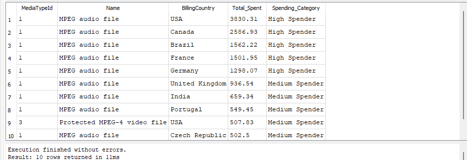 


```sql
/*
-- Top 3 Most Sold Albums by year and customer count that contributed invoice total fro each year
-- with Max Date = 2013-12-22 and Min Date = 2009-01-01
*/

WITH AlbumSales AS (
    SELECT  
        Album.AlbumId,
        Album.Title AS AlbumTitle,
        strftime('%Y', Invoice.InvoiceDate) AS Year,
        SUM(Invoice.Total) AS TotalSales,
        COUNT(DISTINCT Invoice.CustomerId) AS CustomerCount
    FROM Invoice
    JOIN InvoiceLine
        ON Invoice.InvoiceId = InvoiceLine.InvoiceId
    JOIN Track
        ON InvoiceLine.TrackId = Track.TrackId
    JOIN Album
        ON Track.AlbumId = Album.AlbumId
    WHERE Invoice.InvoiceDate BETWEEN '2009-01-01' AND '2013-12-22'
    GROUP BY Album.AlbumId, Album.Title, Year
),
RankedAlbums AS (
    SELECT 
        AlbumId,
        AlbumTitle,
        Year,
        TotalSales,
        CustomerCount,
        RANK() OVER (PARTITION BY Year ORDER BY TotalSales DESC) AS SalesRank
    FROM AlbumSales
)
SELECT 
    AlbumTitle,
    Year,
    TotalSales,
    CustomerCount
FROM RankedAlbums
WHERE SalesRank <= 3
ORDER BY Year, TotalSales DESC;

```
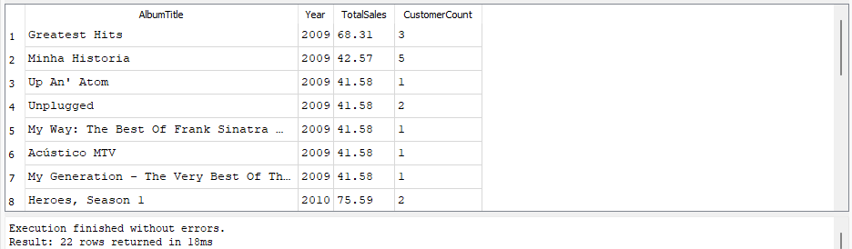 


```sql
/*
-- Return all track names that are longer than the average song length.
*/

SELECT 
    Name,
    Milliseconds
FROM Track
WHERE Milliseconds > (SELECT AVG(Milliseconds) FROM Track)
ORDER BY Milliseconds DESC;
```
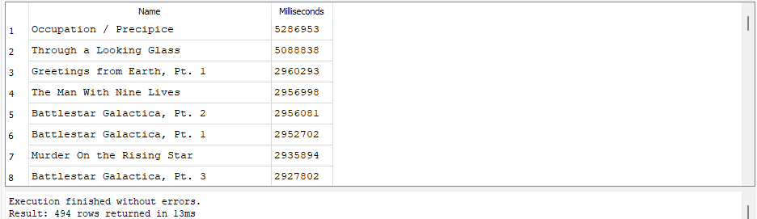 

### Export Data from DB Browser into Spreadsheet
To create the visualisation that promote detailed insights and recommendation, i will be moving queried data out of the SQL and into Excel which the data exported would be use to create visualise chat, to export the result of my queries from DB Browser, using the **Export to CSV**  button below and to the right of the result window as shown in the image below.

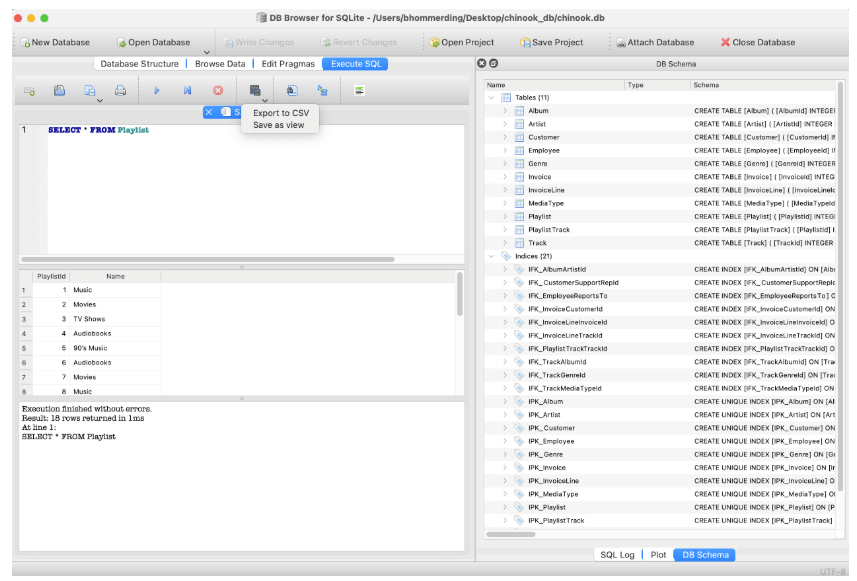 

Select Export to CSV, and then selct the settings that match the ones below. Make sure your setting on Newline character is set to Unix: LF(/n). Then i will be able to use the downloaded queries data in a spreadsheet application.
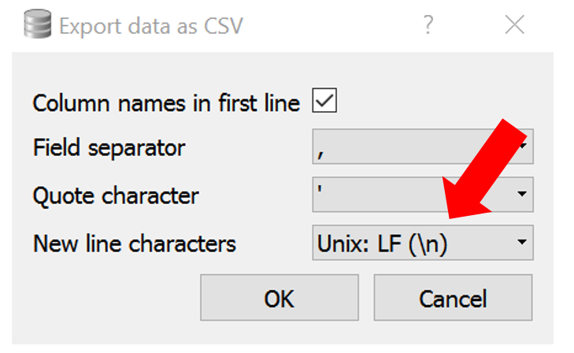 

# Detailed Insights and Recomendations

### PROBLEM STATEMENT 1: Identify and Understand High-Value Customers
**WHICH COUNTRY HAVE THE MOST INVOICES?**  
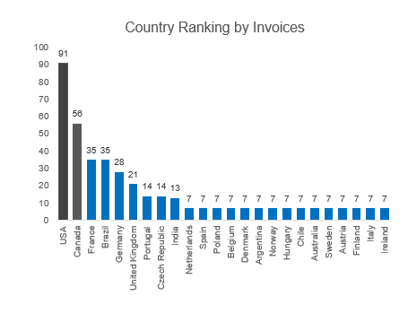  

- USA leads with 91 Invoices, followed by Canada (58), France (35), and Brazil (35).
- Roughly 15 countries have equal invoice count (7)

**Insight:**  
The USA and Canada represent the primary customer markets.

**Recomendation:**   
    - Priortise events, ads, and product launches in the USA and Canada.  
    - Use regional content strategies in lower-volume countries to increase awareness and engagement.

**WHICH CITIES HAS THE BEST CUSTOMERS?**  
As this would support the Event Manager with making decision or planning strategicaly to throw a promotional Music Festival in the cities with the best customers.  

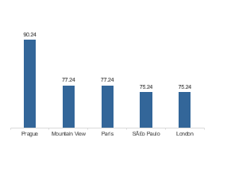

- Prague has the highest-value customer (£90). clearly outperforming others.
- Others cities like Mountian View, Paris. Sao Paulo and London have similar performance (£75)

**Insight:**  
Prague is an outlier market with a high-spending individual.  

**Recommendation:**  
    - Target Prague for VIP evnets, exclusive merchandies, or ambassador parthnerships.  
    - Treat other cities as equally strong strong secondary markets for touring and promotions.  


**WHO ARE THE BEST CUSTOMERS?**  
The customers who spent the most money in the history of the music Store.

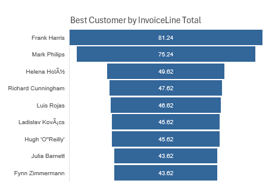


- **Frank Harris** and **Mark Philips** are top spenders, followed by  **Helena Hola** and **Richard Cunningham**.
- Several customers contribute roughly equally in the mid-tier range (~£45–£50).

**Insight:**  
Indicate a mix of high-value and consistent mid-tier customers.

**Recommendation:**  
    - Offer exclusive perks to top-tier customers (early access, VIP seating).  
    - Introduce tiered loyalty programs to retain mid-tier customers and increase spending.  


**INVOICE COUNT PER COUNTRY**  
For each of the country respresent a single customer who has spent the most in that country.


- Shows top-spending customers across multiple countries, with values fairly close.

**Insight:**  
Strong individual engagement is spread evenly across countries.  

**Recommendation:**  
- Recognise these users with "Top Fan in Your Country" campaigns.  

- Use this insight to develop localized influencer partnerships or spotlight content.

### PROBLEM STATEMENT 2: Understand Music, Artist Preference and Behaviour 

**TOP ARTISTS BY INVOICE TOTAL COUNT**  
Find which artist has the most according to the InvoiceLine count, this is required for the next or solution below.  

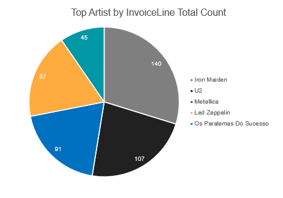

- Iron Maiden (140) leads, followed by U2 (107), Metallica (91), and Led Zeppelin (87).

**Insight:** A handful of legendary rock artists dominate sales volume.

**Recommendation:**  
Focus festival headliners and playlist themes around these artists.  
Bundle their tracks in box sets or “best of” collections.  


**CUSTOMER CONTRIBUTING TO TOP 1 ARTIST(IRON MAIDEN)**  
Since we are aware of artist that has the most according to InvoiceLine, then we can tell which customers spent the most on the top-earning artist.  

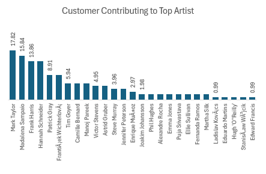


- **Mark Taylor**, **Madalena Sampaio**, and **Hannah Schneider** top the list of Iron Maiden supporters.  
- Long-tail of contributors follows with < 5 purchases each.

**Insight:** A few highly dedicated fans drive artist-specific sales.  

**Recommendation:**  
Uses this for fan club targeting and Iron Maiden-centric events or merchandise. 
 
Encourage the long tail of low-spenders to engage more via exclusive offers.

**ROCK MUSIC LISTENER BY COUNTRY?**

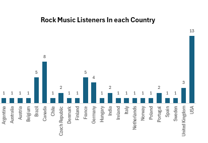


- USA (13) and Canada (8) have the highest number of unique Rock listeners.
- USA (13) and Canada (8) have the highest number of unique Rock listeners.

**Insight:**  
Rock music has a strong foothold in North America.

**Recommendation:**  
- Focus Rock merchandise, marketing, and tour plans in the USA and Canada.
- Conduct audience development campaigns in countries with lower engagement.


**TOP ARTIST WITH THE MOST ROCK GENRE?**  
Information about Artrist information to support in decision making when it comes to inviting roct artist to an event or inventory purpose.  

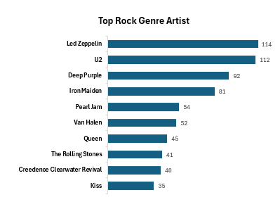


- Top artists: **Led Zeppelin**, **U2**, **Deep Purple**, **Iron Maiden**.
- Follows a descending popularity trend.

**Insight:**  
Follows a descending popularity trend.  

**Recommendation:**  
- Prioritize these artists for festival headliners.  
- Create themed playlists, merch bundles, and fan experiences around them.


**POPUPLAR GENRE IN EACH COUNTRY?**

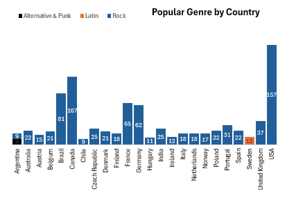


- **Rock** dominates most countries (especially USA, Canada, France).
- **Latin** is popular in Spain, while Alternative & Punk has nice apeal in few regions.

**Insights:**  
Genre preferences vary by country but most countires prefered Rock music genre the most.  

**Recommendation:**  
- Curate region-specific setlists for fedtivals.  
- Run genre-based marketing campaings aligned with cultural preferences.  
For example, rock-heavy festival in the **USA**, Latin-heavy in **Spain**.


### PROBLEM STATEMENT 3: Optimise Product offering base on MediaType and Album Popularity
**MOST POPULAR MEDIA TYPE?**  

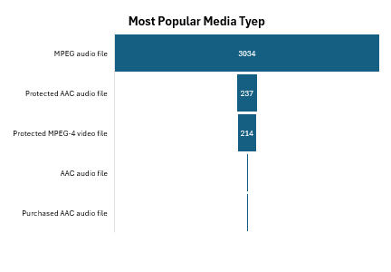

- **MPEG Audio File** domainates with 3,3034 records.
- Other type (AAC, Protected AAC, MPEG-4) trail far behind.

**Insight:**  
Most users comsume standard auidio formarts.  

**Recommendation:**  
- Focus inventory and digital licensing on MPEG audio.  
- Avoid overstocking other less_used formats unless tied to exclusive content(e.g video or DRM-protected tracks).


**TOP 10 COUNTRY TOTAL SPENT BY MEDIA TYPE AND SPENDING CATEGORIES?**

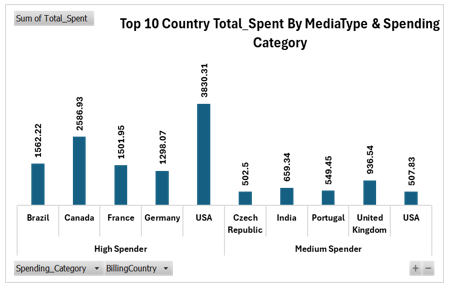

- USA leads in spending (≈ $3,830), followed by Canada, France, and Brazil.
- Countries are categorized into High and Medium Spenders.

**Insight:**  
Your highest revenue markets are clear. USA is the prime target for upsells and exclusive content.  

**Recommendation:**  
- Focus high-budget campaigns in USA and Canada.  
- Target medium spenders with bundled deals or discounts to increase CLV.  


**TOP 3 TOTAL SALES & CUSTOMERS CONTRIBUTION FOR EACH YEAR?**  
Top 3 most sold Albums by year and customer count that contributed with Max Date = 2013-12-22 and Min Date = 2009-01-01.  

 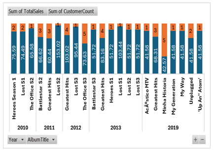

- **"Greatest Hits"** and **"The Office"** series were consistent top sellers across years.
- Customer count varies, showing deep loyalty vs. broad appeal trade-offs.

**Insight:**  
Some albums have both high revenue and broad reach, others have fewer but high-value buyers.  

**Recommendation:**  
- Promote Greatest Hits and best-selling albums as premium packages.  
- Consider re-releasing or bundling top albums for new customers.  
  

**DISTRIBUTION OF MUSIC GREATER THAN AVERAGE MUSIC LENGTH?**  

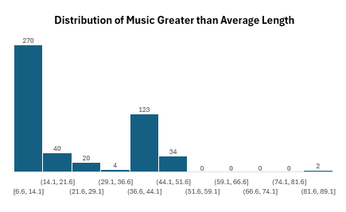


- Most tracks (270) fall between 6.6 and 14.1 minutes.
- Very few songs exceed 59 minutes.

**Insight:**  
Long tracks are rare beyond a certain point. This informs playlist design and helps decide what kind of music suits concert intermissions, streaming bundles, or premium track promotions.  

**Recommendation:**  
- Use shorter-to-medium-length tracks for general playlists.  
- Reserve longer tracks for exclusive or immersive experiences (e.g., live sessions or deluxe editions).  
